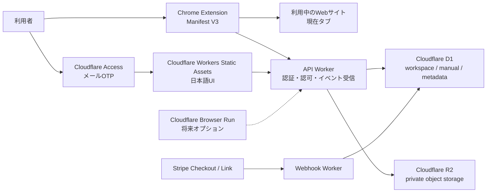

# システム概要

Status: Accepted

## 構成

## 採用判断

- 操作記録の第一方式はChrome Extension Manifest V3とする。
- 利用者が普段使っているChromeの現在タブで記録を行う。
- MVPでは `activeTab` と `scripting` を中心とした最小権限設計を優先する。
- 利用者の明示操作で記録を開始し、対象タブだけを記録対象にする。
- 操作イベントと必要なスクリーンショットだけをAPI Workerへ送る。
- Cloudflare D1を業務データとファイルメタデータの正本にする。
- Cloudflare AccessのJWTをWorkerで検証し、D1のmembershipとroleを業務認可の正本にする。
- ファイル本体はprivate R2に保存する。
- Stripeの課金確定は署名検証済みWebhookを正本にする。
- Cloudflare Browser RunはMVP必須依存から外し、将来の自動処理用途だけ再評価する。

## Chrome拡張の責務

- 記録開始・停止UI。
- 現在タブでのクリック、入力完了、遷移等のイベント取得。
- 手順生成に必要な対象名の抽出。
- 必要なスクリーンショット取得。
- password、カード番号、token、個人番号等の入力値をイベントへ含めない。
- Cookie、Authorization、password manager由来情報を取得しない。
- 記録終了時に一時状態を破棄する。

拡張機能は業務認可の正本ではない。extension ID、ローカルstate、DOM上の値を信用せず、サーバー側でAccess主体とworkspace境界を再検証する。

## 信頼境界

- Chrome拡張を含むブラウザクライアントは信用しない。
- API Workerで業務認可を行う。
- Accessの到達許可とアプリ内権限を分離し、Worker認可とworkspace固定D1 queryを二重の防衛線にする。
- Storage objectはCloudflare R2のprivate bucketに保存する。業務assetのreadは毎回Access/D1または有効な共有grantとD1状態を再検証するWorker proxyに限定する。
- 入力値、Cookie、Authorization、共有生トークン、secretをDBやログへ保存しない。
- 拡張が要求するChrome権限は最小化し、利用者が記録を開始していないタブを継続監視しない。

## 主要リスク

- Chrome Web Storeの審査・配布が必要になる。
- Chrome以外のブラウザはMVPの正式サポート外となる。
- 一部サイトのDOM構造、Shadow DOM、iframe、Canvas等では対象要素やスクリーンショットの取得方法を個別検証する必要がある。
- SPAの画面遷移や複雑なWeb Componentsでイベント取りこぼしが起こり得る。
- 拡張権限を広げすぎると、利用者への警告とプライバシーリスクが増える。

Browser Runを将来再導入する場合は、既存のSSRF、egress、Live View、外部原価に関する安全契約を再度適用する。
