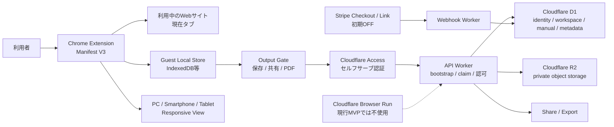

# システム概要

Status: Accepted

## 構成

## 採用判断

- MVPの操作記録方式はChrome Extension Manifest V3だけとする。
- 利用者が普段使っているdesktop Chromeの現在タブで記録する。
- `activeTab` と `scripting` を中心とし、`debugger`と常時`<all_urls>`をMVP必須にしない。
- 利用者の明示操作で記録を開始し、対象タブだけを記録する。
- アカウント未作成のguestはmanual、capture event、screenshot、編集内容をローカルに保持する。
- guest contentをD1 / R2へ送信しない。
- `保存 / 共有 / PDF出力` 等のoutputを選んだ時点でCloudflare Access認証へ進む。
- 認証後はself-service bootstrapでPersonal Workspaceを自動準備し、guest draftをclaimする。
- claim成功後に元output操作を再開する。
- D1を認証後業務データとファイルメタデータの正本にする。
- ファイル本体は認証後にprivate R2へ保存する。
- Stripeは初期OFFとし、課金状態の正本は有効化後も署名検証済みWebhookとする。
- Cloudflare Browser Run / Browser Session / Live Viewは現行MVP runtimeで使用しない。

## Chrome拡張の責務

- 導入状態の検出。
- PC / smartphone / tablet表示mode選択。
- smartphone / tabletのportrait / landscape。
- responsive viewportへwindowを一時調整し、終了時に元boundsへ戻す。
- 記録開始・停止UI。
- 現在タブでのクリック、入力完了、遷移等のイベント取得。
- 手順生成に必要な対象名の抽出。
- 必要なスクリーンショット取得。
- guest local draft生成・編集・永続化。
- output gateの表示。
- signup後のguest claim handoff。
- password、カード番号、token、個人番号等の入力値をイベントへ含めない。
- Cookie、Authorization、password manager由来情報を取得しない。

Chrome拡張は業務認可の正本ではない。extension ID、local draft ID、DOM上の値、client申告workspaceを信用せず、認証後はWorkerでAccess主体とworkspace境界を再検証する。

## Guest Local Store

ゲスト状態では大きなscreenshotを扱う可能性があるため、主保存先を小容量の設定storageだけに依存させず、IndexedDB等の拡張ローカル永続領域を使う。

- guest draftは利用者端末だけに存在する。
- 拡張削除やブラウザデータ削除で失われ得る。
- claim成功が確認できるまでlocal原本を削除しない。
- guest stateにserver workspaceやfake entitlementを作らない。

## Responsive View

スマホ／タブレット向け手順作成はdesktop Chrome上でresponsive viewportを再現する。

- Chrome windowの元位置・サイズを保存する。
- window APIで調整後、content scriptから`innerWidth / innerHeight`を実測する。
- 目標viewportとの差を必要に応じて補正する。
- 記録終了・取消・例外時に元状態へ復元する。

MVPではUA、DPR、touch event、OS固有レンダリングの完全なdevice emulationを行わない。実機完全再現を製品上で主張しない。

## 認証・bootstrap・claim

output gate後に認証する。

- Access JWTをADR-0028に従い検証する。
- application identityはissuer+subjectを正本とする。
- unknown valid human actorだけを明示bootstrap routeでself-service provisioningできる。
- identity/profile/Personal Workspace/active owner membership/auditをatomicに確定する。
- email一致だけでidentityを移動・復活しない。
- guest claimは短命intent + operation ID + fingerprintで冪等にする。
- claim結果不明時にmanualを二重作成しない。

詳細は `docs/05-api/guest-onboarding-and-claim-api.md` を正とする。

## 信頼境界

- Chrome拡張を含むブラウザclientは信用しない。
- guest contentは認証前にserverへ永続化しない。
- API Workerで業務認可を行う。
- Access到達許可とアプリ内権限を分離し、Worker認可とworkspace固定D1 queryを防衛線にする。
- R2 objectはprivateとし、readは毎回認可するWorker proxyに限定する。
- 入力値、Cookie、Authorization、共有生token、secretをDBやログへ保存しない。
- Chrome権限は最小化し、利用者が記録開始していないタブを継続監視しない。

## 主要リスク

- Chrome Web Storeの審査・配布が必要。
- 拡張導入自体が初回摩擦になるため、install conversionを計測する必要がある。
- Chrome以外のブラウザはMVP正式サポート外。
- 実機モバイルChrome上で拡張を動かす方式ではない。
- responsive viewportと実機UA/touch/DPRには差がある。
- DOM、Shadow DOM、iframe、Canvas、SPA、Web Componentsで取得精度の個別検証が必要。
- guest local-onlyのため、signup前に拡張を削除するとdraftを失う可能性がある。
- guest claim中の通信断・asset upload結果不明を安全に回復する必要がある。

Browser Runを将来再導入する場合は、費用対効果を確認し、既存のSSRF、egress、hard-expiry等の安全契約を別ADRで再度適用する。
