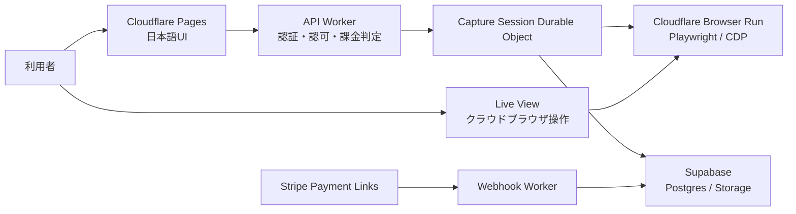

# システム概要

Status: Accepted

## 構成

## 採用判断

- 対象サイトをiframeへ直接埋め込まない。
- Browser Run上で対象サイトをトップレベルページとして開く。
- 初期の操作画面はCloudflare公式Live Viewを別ウィンドウで開く。
- Durable Objectを1キャプチャセッションの状態管理者にする。
- Supabase Postgresを永続データの正本にする。
- Stripeの課金確定は署名検証済みWebhookを正本にする。

## 信頼境界

- ブラウザクライアントは信用しない。
- API Workerで業務認可を行う。
- RLSを最終防衛線にする。
- Storage objectはprivate bucketに保存し、Worker検証後に短期署名URLを発行する。
- Live View URL、共有生トークン、secretはDBやログへ保存しない。

## 主要リスク

- Browser Runが対象サイトからbotとして扱われる。
- 社内ネットワーク、IP制限、端末認証、ハードウェアキーがあるサイトでは使えない可能性がある。
- Live Viewとイベント記録/スクリーンショットの同期精度はP0検証が必要。
- Cloudflare Browser Runの処理地域は日本固定を保証しない可能性がある。
