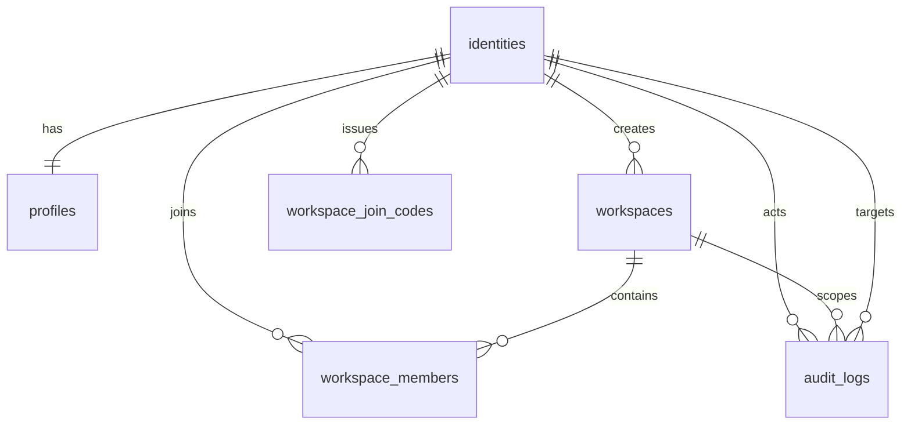

# D1 identity / workspace schema

Status: Accepted

## S2 bootstrap追加schema

`migrations/0003_d1_onboarding_bootstrap.sql`はactor+operation単位の確定結果を`onboarding_bootstrap_operations`へ保持し、operationのapplication identityがそのworkspaceの`created_by`であるactiveなPersonal Workspaceとactive owner membershipに一致する場合だけ保存する。`created_identity`と`created_at`を再送時も変更せず、operation結果はappend-onlyで挿入置換と削除を拒否する。`operation_id`はTEXT型を強制し、16〜128文字のASCII英数字・`_`・`-`だけを保存する。`onboarding_signup_events`はapplication identityごとに一意で、identity新規作成時だけ同じD1 batch内で記録する。D1 triggerはsignup eventのapplication／operation／workspaceが`created_identity = 1`の同一bootstrap結果に一致し、`event_id`が固定namespace・event type・application ID長・application ID・operation IDのlength-delimited値、`occurred_at`がoperationの`created_at`と一致する場合だけinsert/updateを許可する。eventのapplication／operation／workspaceは確定後変更できず、event自体もappend-onlyで挿入置換と削除を拒否する。operationのapplication／operation／workspace／`created_identity`／`created_at`確定後変更も拒否する。本文・画像・email・Access credentialはこれらのtableへ保存しない。identity、profile、personal workspace、owner、作成audit、operation結果、signup eventは1 batchで確定する。既存disabled identity、停止・削除済みpersonal workspace、既存の非owner／非active membershipを復活させない。migration追加はremote適用の証跡ではない。

このM2のmigrationはCloudflare D1の内部alpha用であり、productionや実データへ適用しない。Workerの認証済みapplication identityとworkspace所属をD1で再照合するための最小schemaである。既存のSupabase schema・migration・RLSは移行前baselineとして保持する。

## Tables

- `identities`は検証済みAccessの`issuer + subject`を正本とする。subjectは前後空白を除去して空でないことだけを検査し、保存・lookupには原文字列を使う。`UNIQUE(issuer, subject)`とactive/disabled CHECKを持つ。最後の有効ownerを失わせるidentityのdisabled化もDB triggerで拒否する。有効ownerはactive identityとactive owner membershipの両方を満たす者とし、disabled identityを代替ownerに数えない。
- `profiles`はidentityと1対1で、表示名・locale・timezoneだけを保持する。email、JWT、Access tokenは保存しない。
- `workspaces`はnameをtrim後Unicode code pointで1–64、slugをtrim・小文字化後ASCIIの3–63文字へ正規化する。`workspace_kind`は`standard | personal`の明示値で、既存rowは安全側の`standard`へbackfillし、created_byからpersonalを推測しない。id、created_by、created_at、workspace_kindは更新しないtriggerを持つ。active slugだけをpartial unique indexで一意にする。
- `workspace_kind = 'personal'`はstatusに関係なく`created_by`ごとに最大1rowとするpartial unique indexを持つ。activeならbootstrap再送は同じworkspaceIdへ収束し、suspended／deletedなら2件目を作らず`PERSONAL_WORKSPACE_UNAVAILABLE`でfail closedにする。通常workspace APIは常に`standard`を作成し、kindの変更APIを提供しない。
- `workspace_members`はworkspaceとidentityの組を一意にし、owner/admin/editor/viewerとactive/invited/removedをCHECKで限定する。workspaceとidentityの変更、activeメンバーの最大1000件、owner transfer、最後のactive ownerの降格・停止・削除をtriggerで拒否する。本人同意コードによる再参加時だけjoined_atを更新する。
- `workspace_join_codes`は32 byte乱数のBearer codeを返すが、DBにはSHA-256の小文字hex digestだけを保存する。10分・単回・再発行時旧code失効はrepositoryのbatchで確定する。
- `audit_logs`は固定されたactionと最小metadataだけをappendする。update/delete triggerでappend-onlyを強制し、平文コード、email、JWT、入力本文を保存しない。

## Authorization and atomic operations

repositoryの公開メソッドは用途別に固定し、resource IDだけの汎用DMLを公開しない。全所属workspace一覧と本人profile・本人join code発行はworkspace IDを要求しない自然な例外であり、いずれもactor identityをSQLへ固定する。それ以外は`actorId`と`workspaceId`を必須にする。各queryはactive identity、active membership、role、workspace statusをSQL条件へ含める。

所属workspace一覧は最大1000件を完全な一覧として返す。固定順序で1001件目まで取得して超過を検出し、超過時はtyped errorを返す。HTTP接続時は既存の `409 WORKSPACES_LIMIT_EXCEEDED` へ写像し、一部だけを成功応答しない。

`createWorkspace`はactive identityを作成者へ固定し、`standard` workspace、owner membership、auditをD1 batchで作成する。`getOrCreatePersonalWorkspace`は明示的な`personal` rowだけを再利用し、別operationIdの並行bootstrapでunique conflictになった場合も既存active rowを再読込して同じworkspaceIdへ収束する。join code消費はコードのissuerを対象identityとして固定し、owner/adminが指定したadmin/editor/viewer role、active owner/adminのworkspace membership、active workspace、期限・単回条件を同一batchで再確認してmembershipとauditを確定する。消費nonceをbatch内だけで照合し、同じ時刻の再送や別workspace再送が後段だけ実行されないようにする。D1にinteractive transaction APIがある前提は置かない。`D1Database.batch()`が途中失敗をatomic rollbackする契約を本番境界とし、ローカルテストadapterも同じrollbackを検証する。

member更新はowner付与・移管・最後のowner喪失・非active membershipの同意なし再活性化・自己停止を拒否する。再活性化は本人が発行したjoin code消費だけが入口である。0件更新は成功にせず、既存行が要求済みstateと一致する冪等再送だけは監査追記なしで成功として扱い、それ以外は呼び出し側で安全なconflict/forbidden結果へ写像する。

最後の有効ownerの保護はworkspaceのactive/suspended/deleted状態にかかわらず保持する。削除・停止したworkspaceを理由にidentity無効化から保護を迂回する例外は設けず、所有権移管・アカウント終了の専用フローは未提供とする。

## Verification boundary

`migrations/0001_d1_identity_workspace.sql`と`migrations/0002_d1_personal_workspace.sql`をNode `node:sqlite`へ順に適用するrepository testは、既存rowのstandard backfill、kind immutable、personal uniqueness、並行bootstrap収束、非active personalのfail closedを含む制約を確認する。`test:d1-binding`は同じmigration列とrepositoryをMiniflare D1 bindingで実行するHosted Linux用smokeとしてcheckへ含め、Windowsでは既知のworkerd起動停止のため明示skipする。今回のローカル実行はlocal SQL adapterとWindows skipまでであり、Cloudflare staging live D1、staging資源、operator provisioning、Access real accountの証明ではない。
